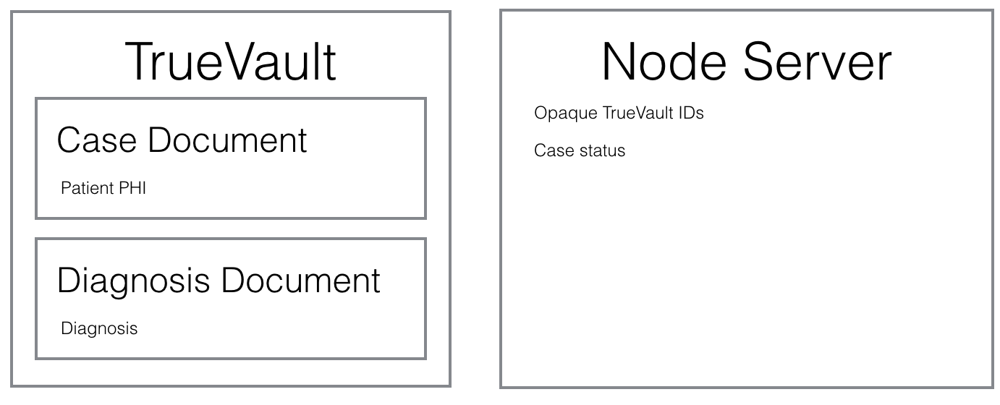
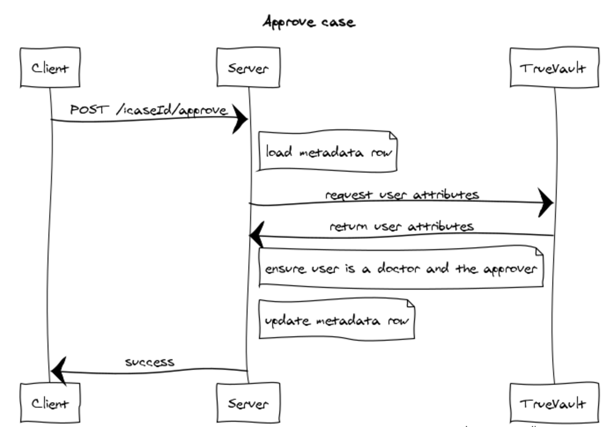

# TrueVault React Sample App

This is a sample app demonstrating how to build a collaborative diagnosis tool with TrueVault. There are three high-level components to keep in mind: 

1. The front-end JS App, which uses React & Redux. The code is in the `src` directory. 
1. A custom backend server, written in Node. The code for this is in the `server` directory.
1. TrueVault. You can see interactions with TrueVault by looking for usages of the functions in the `tv.js` file.

This application has these three components to demonstrate the most common real-world use of TrueVault. All Personally Identifiable Information (PII) is stored in TrueVault, and only de-identified metadata is stored in the custom (less secure) server environment. This shows the "fast path" to HIPAA compliance, since the de-identified data can be stored and processed by non-compliant infrastructure.

## Table of Contents

  * [Overview](#overview)
  * [Running the App](#running-the-app)
    * [Pre-reqs](#running-the-app)
    * [Postgres Database Setup](#posgres-database-setup)
    * [Run App Setup Script](#run-app-setup-script)
    * [Run Node Server](#run-node-server)
    * [Run Client Server](#run-client-server)
  * [Sample App Walkthrough](#sample-app-walkthrough)
  * [Architecture](#architecture)
    * [Data bifurcation](#data-bifurcation)
    * [Groups](#groups)
    * [Creating a case](#creating-a-case)
    * [Retrieving a case](#retrieving-a-case)
    * [Reviewing and approving a case](#reviewing-and-approving-a-case)
  * [Exploring The Code](#exploring-the-code)
  * [Questions](#questions)
  * [Issues](#issues)
  * [License](#license)

## Overview
To run this app, you will need to create a TrueVault trial account for the sample app to interact with live. You will also need to run a Postgres database locally and run a setup script that populates data in TrueVault and Postgres. Finally you will need to run the Node app and React app servers locally using the config file generated by the setup script.

Once you can run the sample app locally, we recommend exploring the UI to get a feel for the sample product, then peeking at the source to see how TrueVault fits in. 

## Running the App

*Note:* This app has only been tested using the latest version of Chrome.

### Pre-reqs
1. Install [yarn](https://yarnpkg.com). On OSX you can run `brew install yarn`
1. Install [Docker Compose](https://docs.docker.com/compose/install/).
1. Create a [trial TrueVault account](https://console.truevault.com/register) and find two UUIDs: Account Id and Admin API Key. The **Account ID** is shown here: https://console.truevault.com/account, and the **Admin API Key** can be generated by:
    1. Create a new user (https://console.truevault.com/users) and copy the User ID.
    1. Go to the `FULL_ADMIN` group (https://console.truevault.com/groups), click "Add" next to Users, and paste in the User's UUID.
    1. Return to the User's view, and re-assign the API Key for that user. That UUID is the **Admin API Key** you'll need below for the app setup script.
1. Create a [trial SendGrid account](https://app.sendgrid.com/signup) if you don't have one, and follow their [instructions](https://sendgrid.com/docs/Classroom/Send/How_Emails_Are_Sent/api_keys.html) for creating your **SendGrid API Key**. Make sure it has the *Mail Send* and *Full Access Template Engine* permissions.

### Postgres Database Setup
1. Change into the server directory: `cd server`
1. Start Postgres: `docker-compose up -d`
1. Set up the database: `./setup-dev-db.sh`
    1. If needed, customize which `psql` to use by setting the `PSQL` variable, e.g. `PSQL=psql92`.
1. Change back to the root directory for the next steps: `cd ..`

### Run App Setup Script
1. Install dependencies for client code: `yarn`
1. Install dependencies for server code: `cd server && yarn && cd ..`
1. Configure your TV account and generate a new `.env` file by running:

        yarn tv-account-setup -- --account-id [Account ID] --admin-api-key [Admin API Key] --sendgrid-api-key [SendGrid API Key] --generate-dummy-data | tee output.txt

   * See [Pre-reqs](#pre-reqs) for details on where the command line arguments come from.
1. **Important!** Keep track of the output of the setup script, it shows generated login credentials for Admin and Doctor Users as well as IDs of resources created. You can reference `output.txt` for user credentials as you progress through the walkthrough (if you kept the `| tee...` clause above.)

### Run Node Server
1. Change into the server directory: `cd server`
1. Run the node server: `node index.js`. 
    * You'll need to `Ctrl-C` and re-run whenever you change the source.
    * The client server will automatically proxy all API requests to the Node server component. Unfortunately, this proxy functionality relies on a hard-coded URL in the top-level `package.json`. This means that the Node server must run on port 3001.

### Run Client Server
1. Create a new tab or window in the root directory.
1. Run `yarn start` to launch the development server. This command should automatically open a new tab or window in your default web browser. This tab will automatically refresh whenever you make changes to source code.
    * Each time the setup script is run, you will need to stop the client server with `Ctrl-C` and rerun `yarn start` in order for the new `.env` config file to take effect.

## Sample App Walkthrough
Now that you have it running, you can use the output of the tv-account-setup script to log in and poke around. We highly recommend exploring the sample app by going through the [Sample App Walkthrough](WALKTHROUGH.md). We take an in-depth look at each view of the sample app and explain architectural decisions and how TrueVault secures the application along the way.

## Architecture

### Data bifurcation

The application stores patient cases, which contain personally identifiable information (PII) and unprotected metadata such as the current case status and associated user ID. PII is stored in TrueVault, and unprotected metadata is stored by the Node server:

Splitting the data allows us to store PII in TrueVault and everything else in the Node server. The PII enjoys access controls and transparent audit logging, while the metadata enjoys the convenience of a traditional relational store. Conceptually, this is similar to storing credit card numbers in Stripe or encryption keys in an HSM.

Each case consists of two documents in TrueVault: one to store the patient's information, and one to store the diagnosis.
This division allows creating groups that allow doctors to view the entire case, but only update the diagnosis.

### Groups

The application uses declarative [TrueVault Groups](https://docs.truevault.com/groups) to restrict access to PII, and
imperative code in the server component to enforce workflow business rules.

Each case has two groups: a read group, and a reviewer group. The read group allows members to view the case's 2 documents, and the reviewer group allows members to update the diagnosis document.

### Creating a case

Creating a single case involves creating the two TrueVault documents, the two TrueVault groups, and, a row in Postgres. The flow looks like this:

1. Create the case document
1. Create the diagnosis document
1. Create the read group
1. Create the reviewer group
1. Create the metadata object in Node server

### Retrieving a case

Loading a case happens in roughly the opposite order:

1. Load the case metadata from Node server, which provides the case and diagnosis TrueVault document IDs
1. Load the case document
1. Load the diagnosis document
1. Combine all 3 results into a single object

### Reviewing and approving a case

Since the business logic around approving/reviewing a case is clearer to express via imperative code than declarative CRUD permissions, it's expressed in the server. Approving/reviewing a case invokes the following flow:

## Exploring the Code
Now that you have it running, and understand the architecture, it's time to dive into the source. You can breeze through the small NodeJS server by looking at `server/index.js`. Read the comments at the top, and take a minute to get acquainted. Don't linger long, all the good stuff is in the client code. 

If you're familiar with React/Redux, this application should be easy to explore. If you're not, dive right into the `src/actions.js` file. That file shows all the interesting architectural decisions, where we decide to send PII to TrueVault and de-identified information to our NodeJS server. This keeps us compliant, but let's us use server-side code for flexible analytics and business rule enforcement. From the `actions.js` source, you can trace the flow of logic in the application. Search for usages of actions in that file to see how the UI triggers server interaction. Drill down through methods you see used in these actions to see how we actually interact with TrueVault.

## Questions

If you would like to learn more about how to build your project using TrueVault, please contact us at help@truevault.com or ask a question on [StackOverflow](https://stackoverflow.com/questions/tagged/truevault) with the tag `truevault`.

## Issues

Is part of the sample app confusing, broken, or incomplete? Let us know! We hope this is an easy to understand codebase and an easy to use app. If we've missed anything, file a GitHub issue or a PR and we'll take a look.

## License

This sample app is released under the [BSD 3-Clause License](LICENSE)
