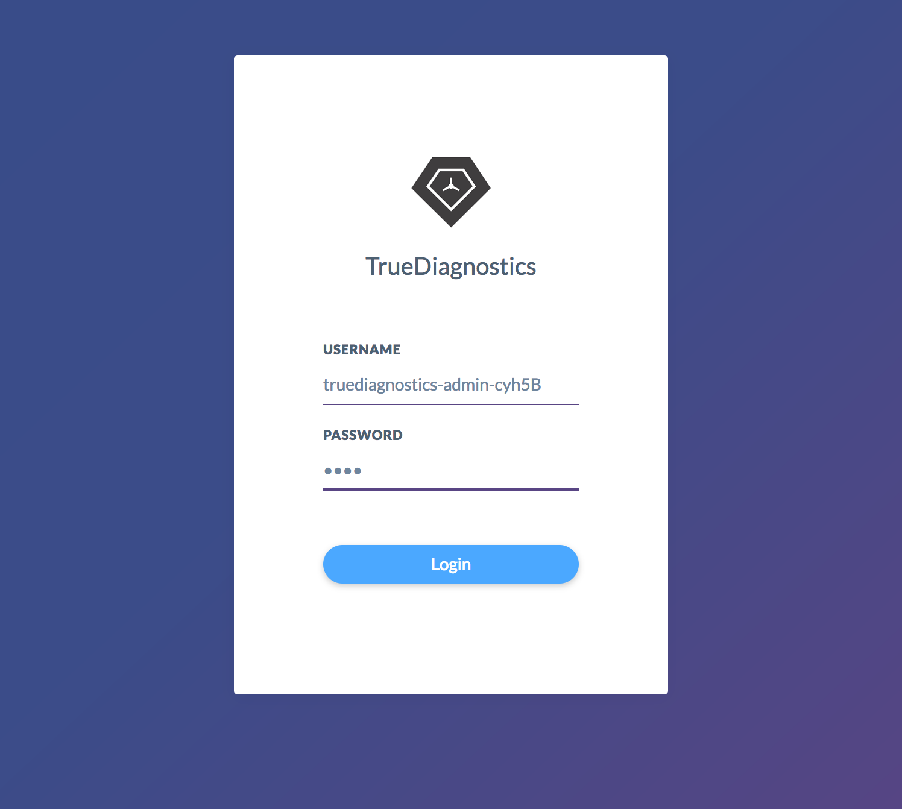
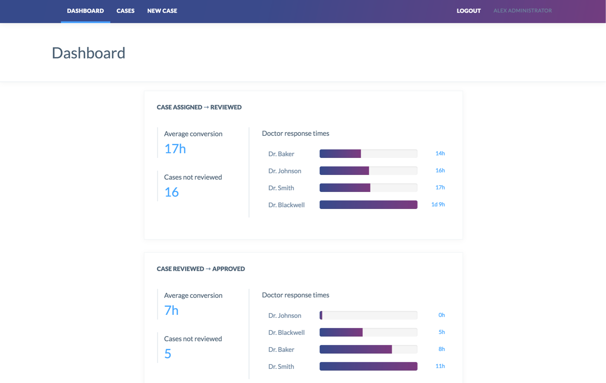
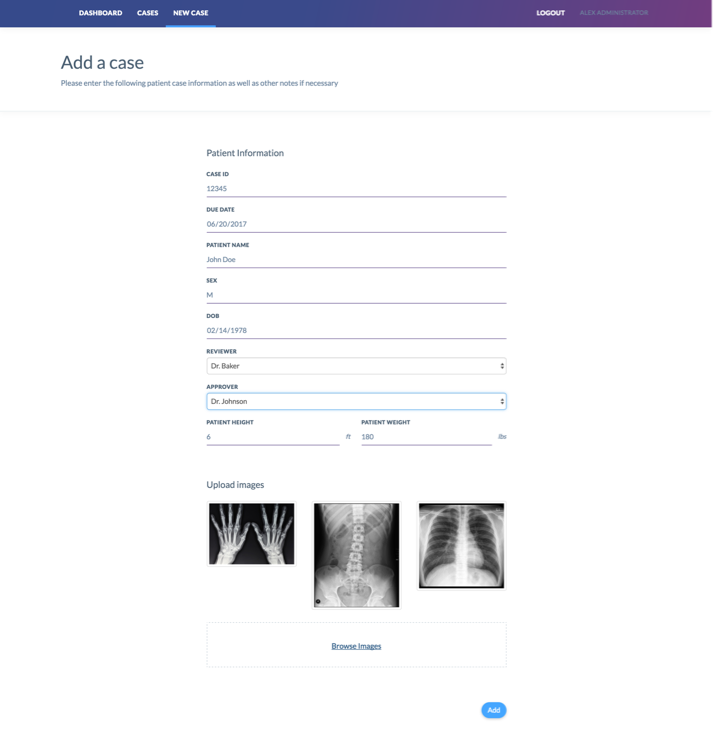
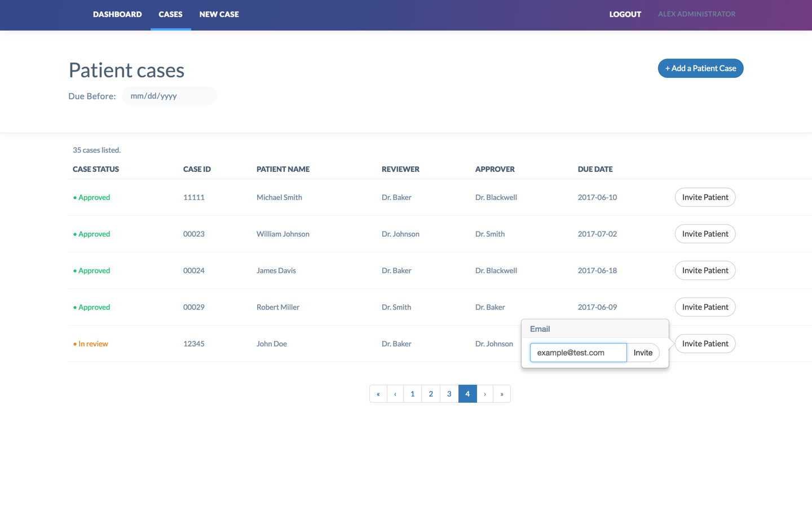
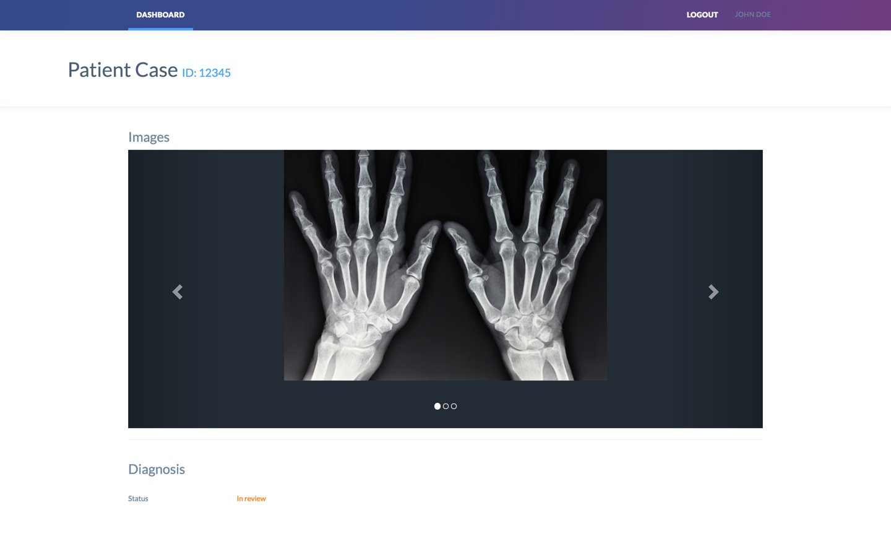
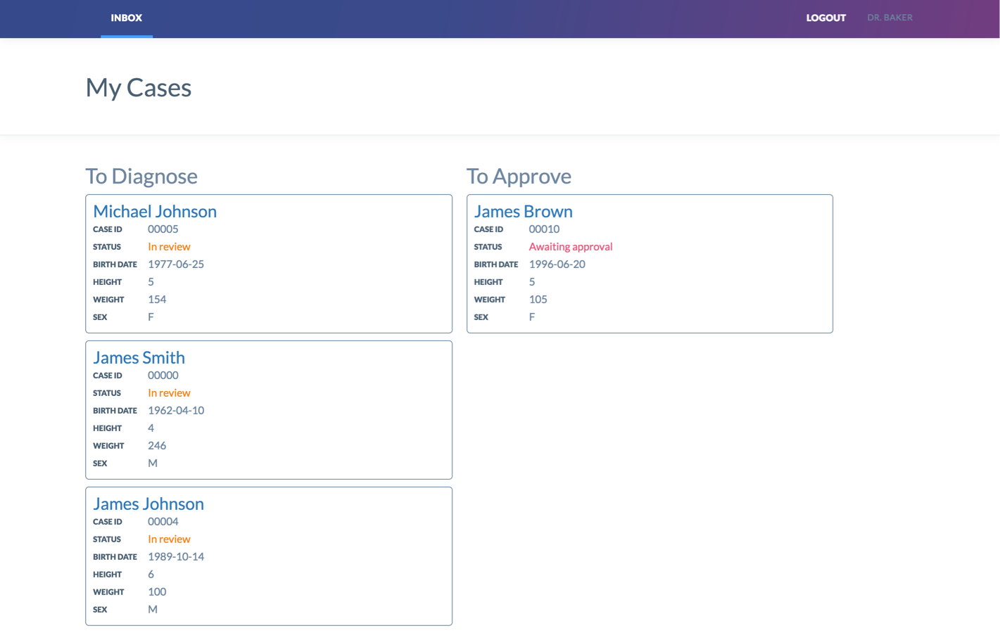
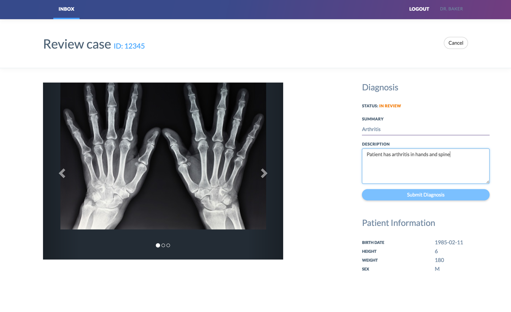
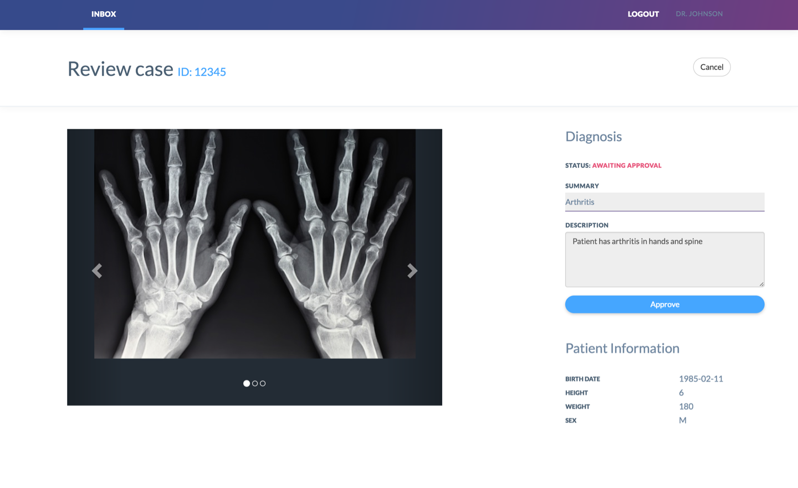

# Sample App Walkthrough

## Table of Contents

  * [Introduction](#introduction)
  * [Site Administrator Login](#site-administratorlogin)
  * [Site Administrator Dashboard](#site-administrator-dashboard)
  * [Site Administrator New Case View](#site-administrator-new-case-view)
  * [Site Administrator Case List View](#site-administrator-case-list-view)
  * [Patient Signup](#patient-signup)
  * [Patient Case View](#patient-case-view)
  * [Reviewer Doctor Inbox](#reviewer-doctor-inbox)
  * [Reviewer Doctor Case View](#reviewer-doctor-case-view)
  * [Approver Doctor Inbox](#approver-doctor-inbox)
  * [Approver Doctor Case View](#approver-doctor-case-view)
  * [Patient Case View Part 2](#patient-case-view-part-2)

## Introduction

This sample app named TrueDiagnostics is a tool that hospital administrators and doctors can use to diagnose and approve patient cases, which can be shared patients.

The following are the various roles in the application:

  * Site Administrator
    * Creates patient cases with demographic information and relevant medical images.
    * Assigns a doctor to diagnose and a doctor to approve each case.
    * Invites patients to view their case.
  * Doctor
    * Responsible for submitting a diagnosis for a case if assigned as the reviewer by the Site Administrator.
    * Responsible for approving a case if assigned as the approver by the Site Administrator.
  * Patient
    * If invited by the Site Administrator, can register to view their case data and status.
    * Receives email updates as their case is diagnosed or approved.

## Site Administrator Login

After running `yarn start`, a new browser window will open with a login screen. Look at the setup script's output to find the Site Administrator's username and password (the username starts with `truediagnostics-admin-`, and the default password is `asdf`). Enter this information and click the Login button.

 
### Developer Notes
The Site Admin user and Doctor users are all created in TrueVault using the setup script. These users must be represented in TrueVault to take advantage of TrueVault's secure authentication features, and so that access controls surrounding data stored in TrueVault can be enforced.

## Site Administrator Dashboard

Once you log in, you will be redirected to the Site Administrator Dashboard. Here you can see a report of Doctor response time data.

### Developer Notes
Data such as how long it takes for a Doctor to review a case is not PII. We store this data in the Node server to take advantage of Postgres aggregate functions in order to obtain the statistics we need.

## Site Administrator New Case View

Click on **New Case** in the top navigation bar to navigate to the New Case view. Here a Site Administrator can create a new case by performing these steps:
  1. Add patient demographic information
  1. Assign Doctors to review and approve the case
  1. Upload relevant images
  

 
Go ahead and fill out the new case form and upload some images. Hold on to the following for reference in later steps:
  * Case ID
  * Review Doctor's name
  * Approver Doctor's name

Finally click the **Add** button to create the case.
 
### Developer Notes
Although this case creation form is unified in the UI, there are many actions taking place behind the scenes. Sensitive demographic information and images are stored in TrueVault, whereas the reviewer and approver IDs are stored in Postgres. This allows for us to enforce specific business rules surrounding the reviewer and approver (e.g. the reviewer isn't allowed to approve a case). We also create the necessary groups to enforce permissions on the documents and BLOBs stored in TrueVault for that particular case.

The steps behind all of this happens in the `createCase` function in [api-helpers.js](src/api-helpers.js). Take a look to see all the nuts and bolts of creating a case in action.
 
## Site Administrator Case List View

After creating a new case, you will be redirected to the case list view, which shows the status and demographic information about each case in a table. You can find the case you created by filtering by due date and sorting the various columns in the table.

Once you find the case you created, you can invite a patient by clicking **Invite Patient** on the very right of the case's row. Type in your email address and click **Invite**.

### Developer Notes
Again, there are a few operations happening in the background to make this unified case list view. We utilize TrueVault's [Search API](https://docs.truevault.com/documentsearch) to filter and sort case results with pagination. We then combine non-sensitive case data (i.e. status, reviewer, and approver) from the Node server with the sensitive demographic information we retrieved from TrueVault.

When the Site Administrator invites a patient to a case, a few things happen. We create a user for the patient in TrueVault, create new groups to enforce permissions for the patient in TrueVault, and associate the patient user with the case in the Node server.

Upon associating the patient with the case, the Node server uses the access token of the Site Administrator to [send an email](https://docs.truevault.com/email) to the patient user using TrueVault. This request tells TrueVault to replace SendGrid template variables with TrueVault data and send the resulting email to the patient.

## Patient Signup

You should receive an email with subject line "Welcome to TrueDiagnostics". If you don't see the email, try checking your spam folder. The link provided in the invite email will take you to the patient registration view. Enter a password and click **Sign Up**.

### Developer Notes
The email contains an API key that the patient can use to change their password. The Node server then invalidates that API key and assigns the user a time-based access token. This is a security measure to ensure there is no active permanent API key for the patient user.

## Patient Case View
 After signing up as a patient, you will be directed to the Patient Case view, which shows the current status of your case and its attached images.

When you are finished, click the **Logout** button in the top navigation bar, and you will be redirected to the login screen.

### Developer Notes
Like previous views, the patient view pulls data from both TrueVault and the Node server. Patient read permissions are enforced in TrueVault by groups created when the Site Administrator added the patient to the case.

## Reviewer Doctor Inbox

From the setup script's output, grab the username of the doctor you assigned as the reviewer when you created the case, and sign in with their password (the username starts with `truediagnostics-dr-<name>-`, and the default password is `asdf`).

After logging in you will see the "My Cases" doctor inbox view. This view shows all the cases that the doctor needs to diagnose, and which they need to approve.

Click on the case we created in the "To Diagnose" column of this view.

### Developer Notes
Again we see the combination of sensitive PII from TrueVault being combined with non-sensitive data from the Node server. The node server filters which cases we see by only sending cases that the doctor is the reviewer or approver of.

## Reviewer Doctor Case View

This view is where the reviewer doctor can submit a diagnosis for a case. It shows the images related to the case, as well as the patient demographic information.

Enter text in the Summary and Description fields and click **Submit Diagnosis** to submit a review. You will be taken back to the "My Cases" screen where you will no longer see the case you just reviewed.

Click logout when you are finished.

### Developer Notes
When the doctor submits a diagnosis, they are updating the diagnosis document that exists separately from the main case document in TrueVault. We partition the data in this manner to enforce the rule that only the reviewer can make a diagnosis. To enforce this permission scheme in TrueVault, only the reviewer was placed in a group with update access to this document, whereas we placed both the approver and reviewer doctor in the group that allows read access to this document.

We also send a request to the Node server to update the review status to `WAITING_FOR_APPROVAL`. The Node server enforces that this request can only be performed by the reviewer, and only if the case is in the `WAITING_FOR_REVIEW` state.

Finally, the Node server uses the doctor's access token to send an email to the patient notifying them that their case has been reviewed.

## Approver Doctor Inbox

This time grab the username of the doctor you assigned as the Approver when you created the case, and sign in with their password. You can see that the previously-reviewed case is now in the "To Approve" column in this doctor's inbox. Click on this case.

## Approver Doctor Case View

This view is where the approver doctor can approve a diagnosis. This is nearly identical to the reviewer doctor view - it shows the images related to the case, as well as the patient demographic information. You will see the reviewer doctor's diagnosis, which is not editable by you as the approver. Click the **Approve** button to approve the case.

### Developer Notes
Upon approving the case, an API request is sent to the Node server to update the status. The node server enforces that only the approver can take this action, and it must be in the `WAITING_FOR_APPROVAL` state in order to be approved.

We can observe that the approver doctor is not able to edit the diagnosis in the UI. Even if the doctor sent an API call to TrueVault directly to update this document, this request would be denied since the approver doctor does not have permission to via a TrueVault group.

## Patient Case View Part 2

As soon as the doctor submits their approval, the patient will receive an email with subject line "TrueDiagnostics Case Approved". You can click the link in the email, log in as the patient, and see that the view now shows a status of "Approved".
